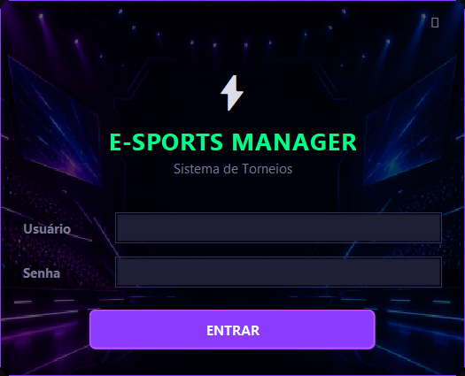
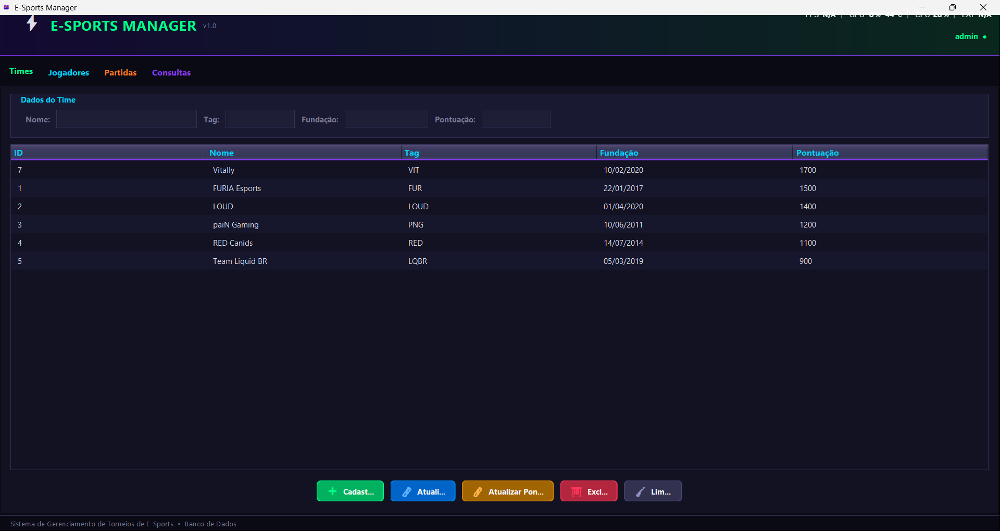
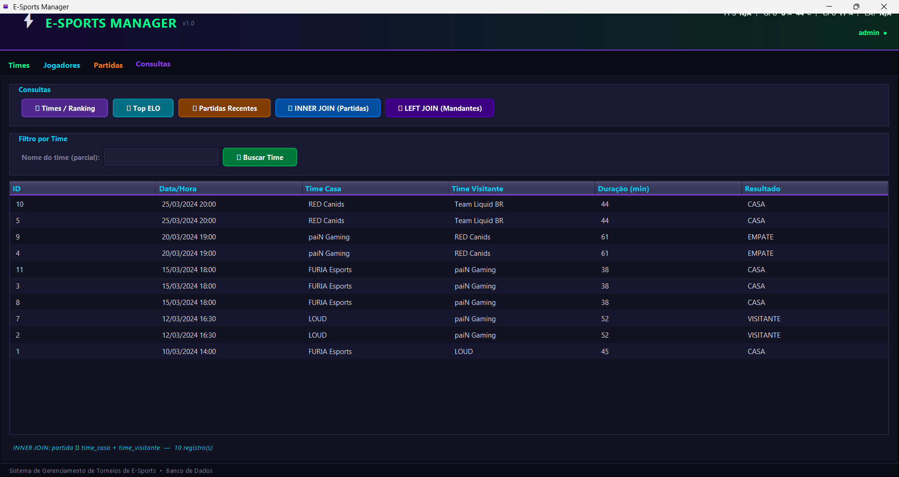

# Sistema de Gerenciamento de Torneios de E-Sports

> Trabalho Acadêmico — 2ª Nota | Disciplina: Banco de Dados | Prof. Anderson Costa — UNIFSA

Sistema de gerenciamento de torneios de e-sports com banco de dados relacional PostgreSQL e aplicação Java com interface gráfica (Swing) tema dark neon e versão console. Permite cadastrar times, jogadores e partidas, além de gerar consultas com ranking, filtros e joins complexos.

---

## Tecnologias Utilizadas

| Camada | Tecnologia |
|---|---|
| Linguagem | Java 17+ |
| Interface Gráfica | Java Swing |
| SGBD | PostgreSQL 14+ |
| Conectividade | JDBC — `postgresql-42.7.3.jar` |
| Scripts SQL | DDL · DML · DQL |

---

## Prints da Aplicação

### Tela de Login




### Menu Principal




### Consulta com JOIN




---

## Vídeo Demonstrativo

> **Link do vídeo:** _[adicionar link do YouTube ou Google Drive aqui]_

O vídeo (máx. 10 min) demonstra:
- Aplicação rodando com login
- Operações CRUD (cadastro, atualização, exclusão, listagem)
- Funcionamento das consultas com INNER JOIN e LEFT JOIN no código e no banco

---

## Banco de Dados — Modelagem

O banco possui **3 tabelas relacionadas** com chaves primárias e estrangeiras:

```
time ──< jogador          (1 time possui N jogadores — FK: fk_time)
time ──< partida (casa)   (1 time joga N partidas em casa — FK: fk_time_casa)
time ──< partida (visit.) (1 time joga N partidas fora — FK: fk_time_visitante)
```

| Tabela | Campos principais |
|---|---|
| `time` | `id_time` PK, `nome`, `tag`, `data_fundacao`, `pontuacao_ranking` |
| `jogador` | `id_jogador` PK, `nickname`, `elo`, `fk_time` FK |
| `partida` | `id_partida` PK, `data_partida`, `duracao_minutos`, `fk_time_casa` FK, `fk_time_visitante` FK, `resultado` |

O diagrama ER completo está em [`diagrama/diagrama_er.md`](diagrama/diagrama_er.md).

---

## Instruções de Execução

### Pré-requisitos

- [Java 17+](https://www.oracle.com/java/technologies/downloads/)
- [PostgreSQL 14+](https://www.postgresql.org/download/)
- Driver JDBC: [`postgresql-42.7.3.jar`](https://jdbc.postgresql.org/download/)

### 1. Configurar o Banco de Dados

Abra o **SQL Shell (psql)** e execute:

```sql
CREATE DATABASE esports_db;
\c esports_db
```

Depois rode os scripts na ordem:

```sql
\i ddl/create_tables.sql
\i dml/insert_data.sql
```

> Ou pelo terminal:
> ```cmd
> psql -U postgres -d esports_db -f ddl/create_tables.sql
> psql -U postgres -d esports_db -f dml/insert_data.sql
> ```

### 2. Adicionar o Driver JDBC

Crie a pasta `lib/` e coloque o `.jar` lá:

```
trabalho-bd-java-esports/
└── lib/
    └── postgresql-42.7.3.jar
```

### 3. Compilar

Abra o CMD ou PowerShell na pasta do projeto:

```cmd
mkdir out

javac -cp "lib/postgresql-42.7.3.jar" -sourcepath src -d out src/br/esports/MainSwing.java

xcopy /E /Y src\br\esports\ui\icons out\br\esports\ui\icons\
```

### 4. Executar

**Interface Gráfica (Swing) — recomendado / +1 ponto bônus:**

```cmd
java -cp "out;lib/postgresql-42.7.3.jar" br.esports.MainSwing
```

**Versão Console:**

```cmd
java -cp "out;lib/postgresql-42.7.3.jar" br.esports.Main
```

### 5. Login

| Campo | Valor |
|---|---|
| Usuário | `admin` |
| Senha | `123` |

### 6. Configurar a Conexão (se necessário)

Edite `src/br/esports/db/ConexaoBD.java`:

```java
private static final String URL     = "jdbc:postgresql://localhost:5432/esports_db";
private static final String USUARIO = "postgres";
private static final String SENHA   = "";   // vazio se não usa senha
```

Após editar, recompile (passo 3).

---

## Funcionalidades (CRUD)

| Aba | Operações |
|---|---|
| **Times** | Cadastrar (Insert), atualizar pontuação, atualizar dados completos (Update), excluir com validação (Delete), listar (Select) |
| **Jogadores** | Cadastrar, atualizar nickname/elo/time, excluir, listar |
| **Partidas** | Registrar, alterar resultado, excluir, listar |
| **Consultas** | Ranking com ordenação, Top ELO, filtro por time, INNER JOIN, LEFT JOIN |

---

## Consultas SQL

As consultas estão em [`dql/queries.sql`](dql/queries.sql). Destaques:

**INNER JOIN — partidas com nomes dos times:**
```sql
SELECT p.id_partida, p.data_partida, p.duracao_minutos,
       tc.nome AS time_casa, tv.nome AS time_visitante, p.resultado
FROM partida p
INNER JOIN time tc ON p.fk_time_casa      = tc.id_time
INNER JOIN time tv ON p.fk_time_visitante = tv.id_time
ORDER BY p.data_partida DESC;
```

**LEFT JOIN — todos os times e total de partidas em casa:**
```sql
SELECT t.nome, t.tag, t.pontuacao_ranking,
       COUNT(p.id_partida) AS partidas_em_casa
FROM time t
LEFT JOIN partida p ON p.fk_time_casa = t.id_time
GROUP BY t.id_time, t.nome, t.tag, t.pontuacao_ranking
ORDER BY partidas_em_casa DESC;
```

---

## Estrutura de Pastas

```
trabalho-bd-java-esports/
├── diagrama/
│   └── diagrama_er.md               → Diagrama Entidade-Relacionamento
├── ddl/
│   └── create_tables.sql            → Criação das tabelas (time, jogador, partida)
├── dml/
│   └── insert_data.sql              → Dados iniciais para teste
├── dql/
│   └── queries.sql                  → Consultas SQL (INNER JOIN, LEFT JOIN, filtros)
├── lib/
│   └── postgresql-42.7.3.jar        → Driver JDBC (adicionar manualmente)
├── screenshots/                     → Prints da aplicação para o README
├── out/                             → Bytecode compilado (gerado pelo javac)
├── src/br/esports/
│   ├── Main.java                    → Entry point versão console
│   ├── MainSwing.java               → Entry point versão gráfica (Swing)
│   ├── db/ConexaoBD.java            → Fábrica de conexão JDBC
│   ├── model/                       → Time.java · Jogador.java · Partida.java
│   ├── dao/                         → Interfaces DAO + implementações
│   ├── service/                     → Regras de negócio
│   └── ui/
│       ├── Tema.java                → Paleta de cores, fontes e fábrica de componentes
│       ├── LoginFrame.java          → Tela de login (fundo arena e-sports)
│       ├── MainFrame.java           → Janela principal com abas coloridas
│       ├── TimePanel.java           → Aba Times
│       ├── JogadorPanel.java        → Aba Jogadores
│       ├── PartidaPanel.java        → Aba Partidas
│       ├── ConsultaPanel.java       → Aba Consultas
│       └── icons/                   → fundo.png · icone.png · lixeira.png · furia.png
└── README.md
```

---

## Interface

- Tema **dark neon** com paleta e-sports (verde, roxo, cyan, laranja)
- Tela de login com fundo de arena, sem bordas, arrastável
- Botões arredondados com efeito hover
- Tabelas com linhas alternadas e header colorido
- Ícone personalizado na barra de título e taskbar
